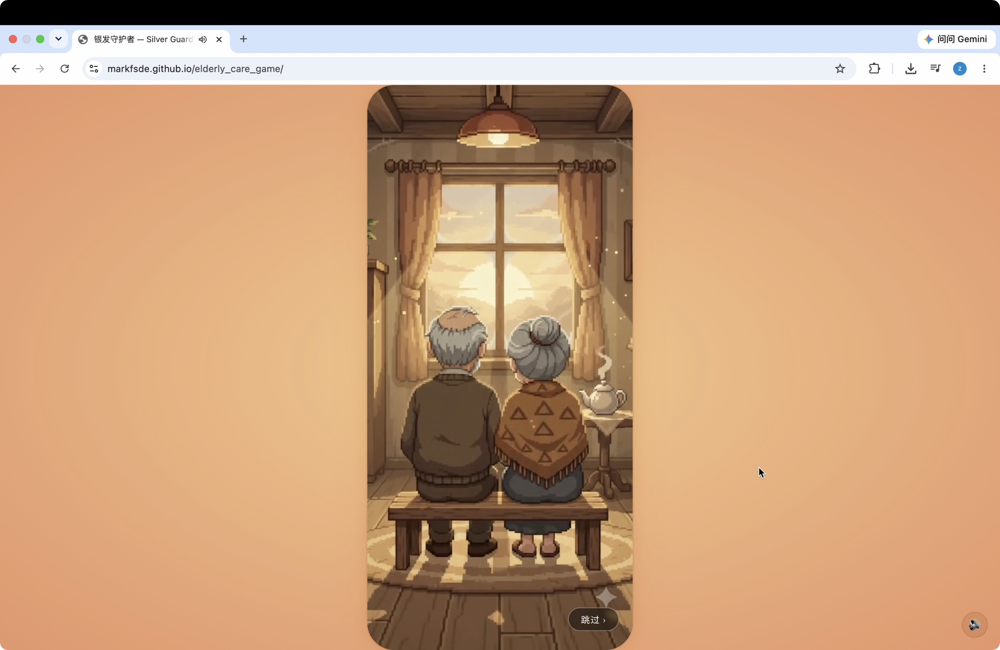
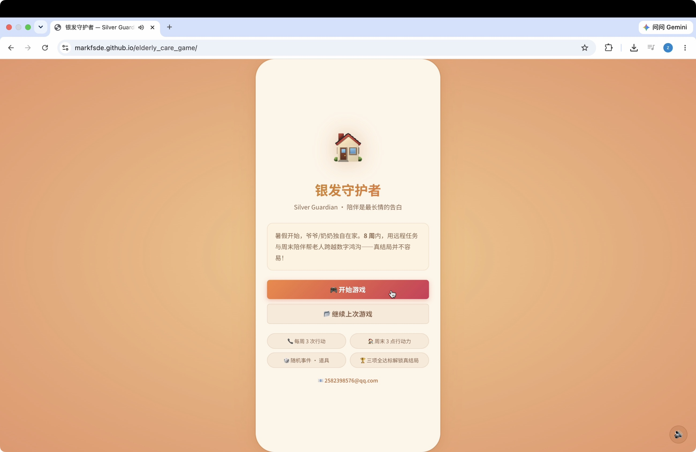
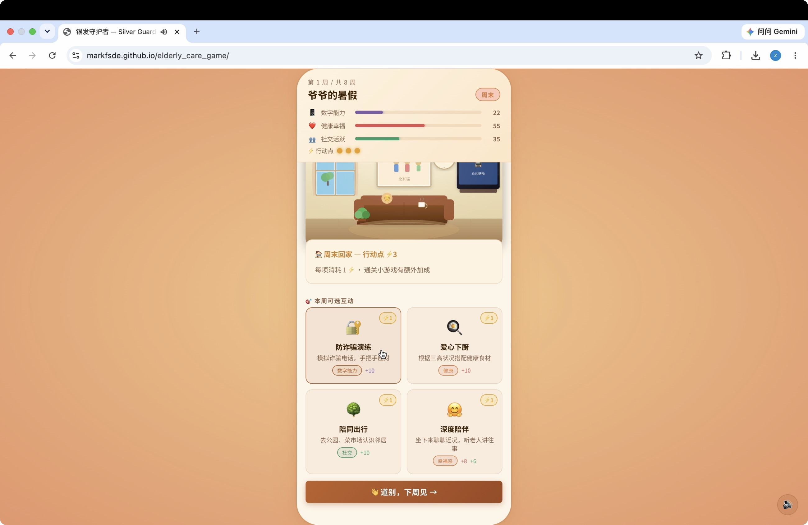
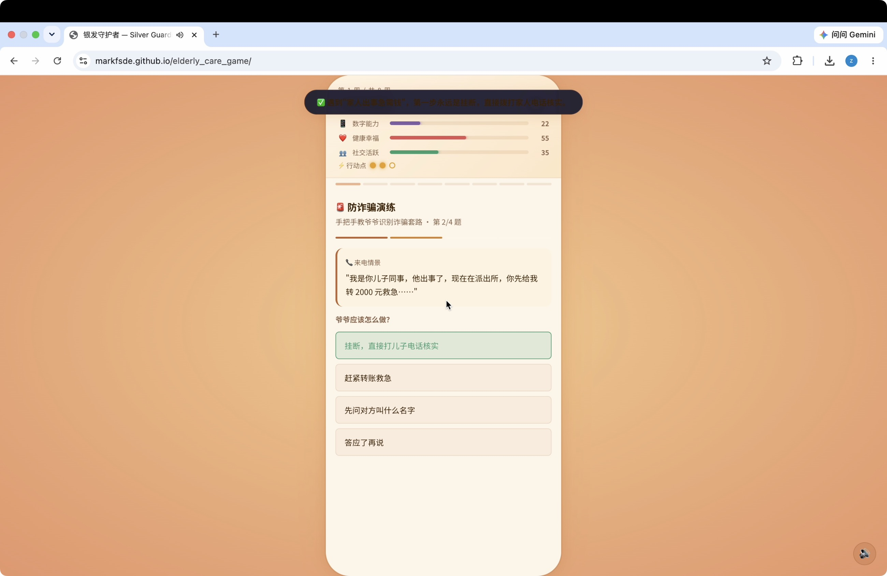
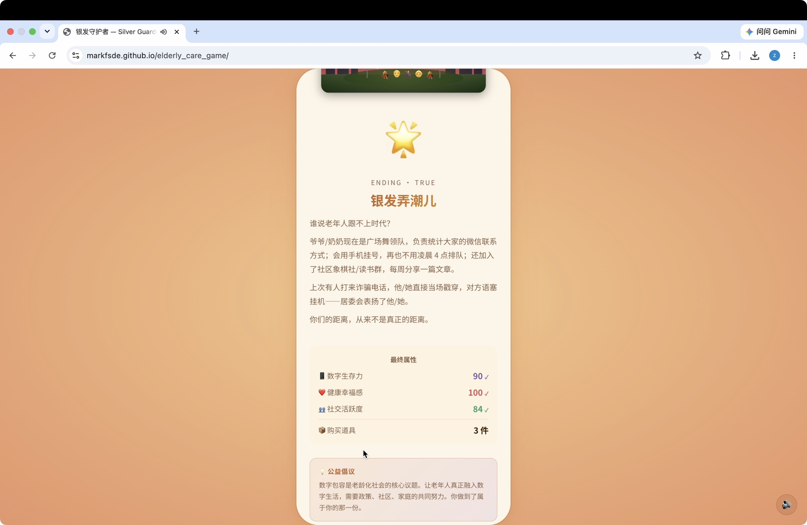



### 作品简介

这是一款关于陪伴与关爱老人的游戏。玩家扮演在外地求学或工作的晚辈，用8周时间通过远程布置任务和周末回家陪伴，帮助独居的爷爷/奶奶跨越"数字鸿沟"——学会手机购物、识破电信诈骗、融入社区生活。游戏以数字生存力、健康幸福感、社交活跃度三项属性为核心，结合防诈骗问答、食材搭配、广场舞节奏等五种互动小游戏，有三种不同结局等待解锁。改游戏旨在通过轻松的玩法引发年轻人对老年群体的关爱。

### AI辅助创作说明

概要：本项目在创作过程中使用了多模态AI工具，实现从概念到项目落地的全过程。

代码实现：Claude（本地Agentic模式）
代码部分采用 Anthropic Claude在本地以对话式编程方式完成。具体流程是：在本地终端通过Claude进行实时代码生成与调试，覆盖游戏逻辑、状态管理、UI组件、CSS动画系统及 Web Audio API音乐引擎等模块。每次迭代完成后，通过 Git进行版本管理并推送至GitHub，最终借助GitHub Pages完成零成本静态部署。

开场动画：Google Gemini
开场像素风动画由Gemini的视频生成能力完成。作者提供了场景描述提示词，由Gemini生成入场视频，再由作者筛选、集成至游戏入口场景。

设计原因：
这套工作流本质上是一种人机协作的分层创作模式：游戏的核心创意、叙事框架与玩法机制设计均源于作者本人的独立构思。而代码与视觉效果均由AI辅助完成，并用github实现了版本管理与网页部署。

### demo视频

出场动画

游戏入口

游玩基础界面，可选择每周与爷爷/奶奶的互动

选择互动后可能产生的交互游玩设计

结束界面/结局

## 游戏链接

https://markfsde.github.io/elderly_care_game/

