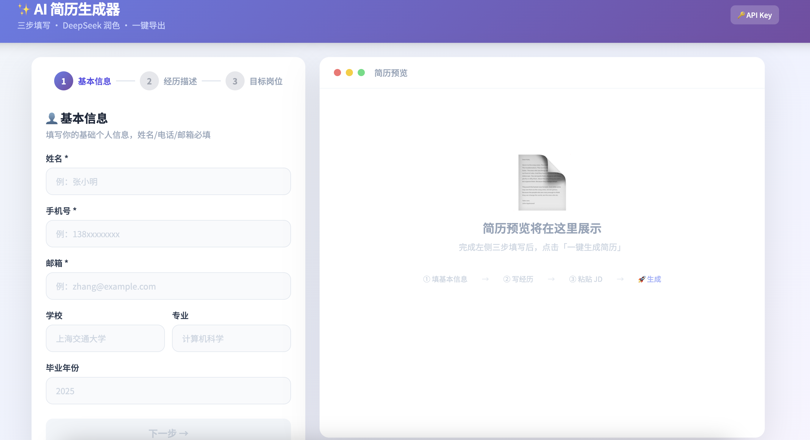

### 体验网址

https://markfsde.github.io/resume_project/

### 效果展示

### 产品概念

🏢 企业端：低门槛、可掌控的 AI 解决方案
自带API架构： 企业客户自主填入 DeepSeek/OpenAI 密钥，将大模型成本降至最低。

快速品牌华：零代码快速更换品牌视觉，让企业在数分钟内拥有专属的、面向用户的 AI 智能应用。

🧑‍💻 用户端：对新人极度友好的简历工坊
简易的信息表单：抛弃复杂的Prompt编写，通过高交互性的引导式表单，帮助职场新人梳理核心经历。

智能润色与即时交付：一键调用后台高规格AI引擎，对弱口语化表达进行专业级重塑，提供高保真PDF预览与一键下载。